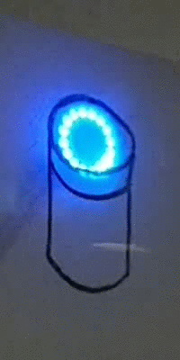

This Arduino sketch makes it easy to recreate the funky ring
of LEDs characteristic for Alexa devices. The sketch includes
all the animations currently used by the Amazon Echo devices,
such as the blue booting spinner, orange WiFi connection error
pulse, and of course the slightly-dimmed red Mute setting.

The sketch might be useful for adding a recognisable LED
interface to custom devices built with
[ALexa AVS](https://developer.amazon.com/alexa-voice-service),
or just for pimping any other place in need for blinking lights.

Simply connect a NeoPixel (WS2812B) ring of 12+ RGB LEDs to
pin 2, and add custom logic controlling which animations to
show. At some point this should be rewritten as library.

Dependencies:
- [Adafruit NeoPixel](https://github.com/adafruit/Adafruit_NeoPixel) library

